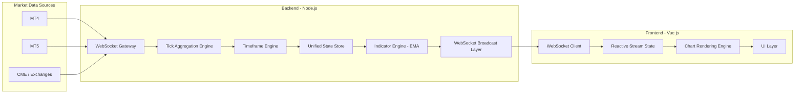
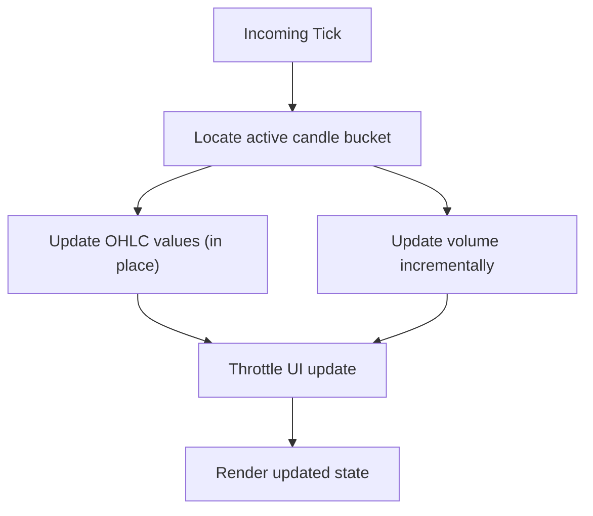
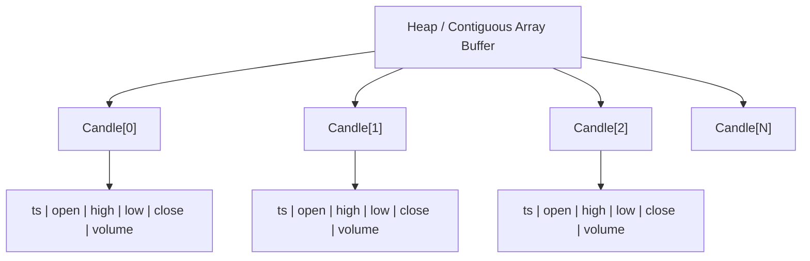
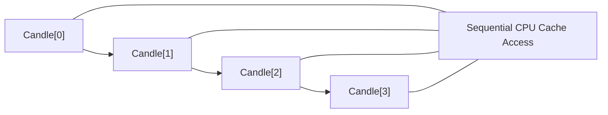
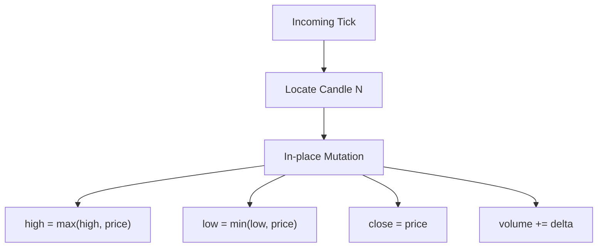
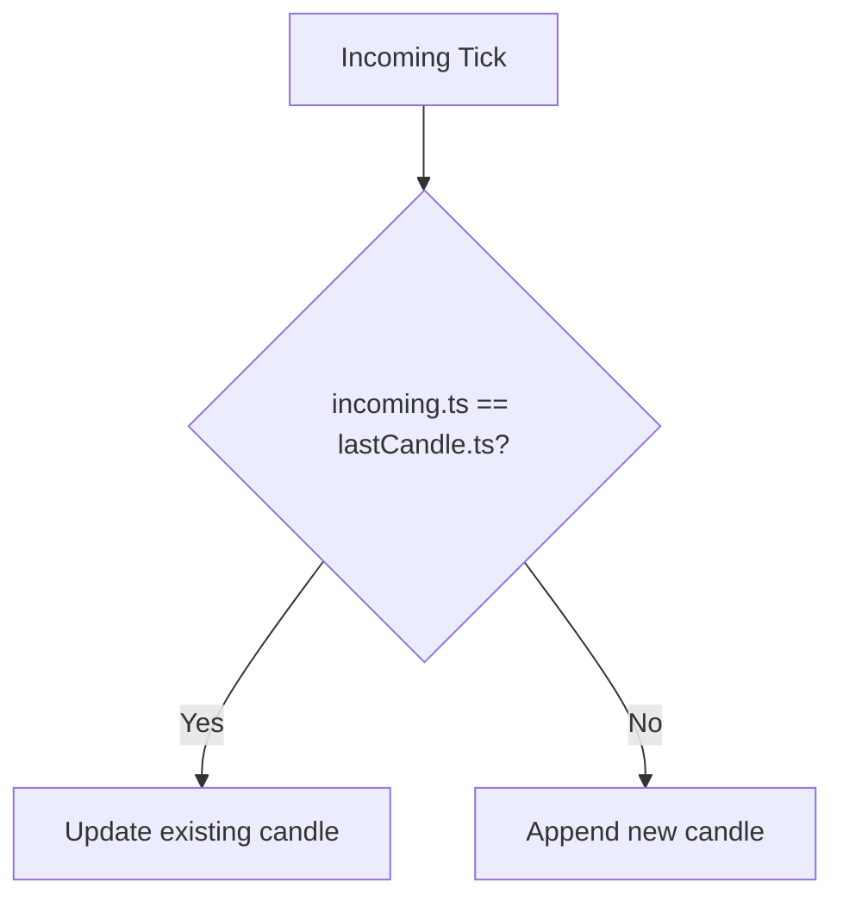

# Smart Terminal — Real-Time Market Computation System

Smart Terminal is a real-time market infrastructure system designed to process streaming financial data and maintain a continuously evolving market state.

It combines data engineering, time-series computation, and browser-based visualization into a single continuous system.

---

# 1. OVERVIEW

The system processes live and historical market data across 500+ instruments and maintains a unified state model of financial behavior.

Instead of treating charts as static visualizations, the system treats market data as a continuous event stream.

---

# 2. CORE CAPABILITIES

- Real-time market data ingestion via WebSocket
- Tick-to-OHLCV aggregation engine
- Multi-timeframe transformation (1M → 1Mo)
- Live + historical data merging without state reset
- Multi-symbol streaming (500+ instruments)
- EMA indicator system (extensible architecture)
- Automatic reconnection and state recovery
- Memory-bounded rolling dataset model

---

# 3. SYSTEM ARCHITECTURE

Market Feeds (MT4/MT5 + CME)  
→ WebSocket Streaming Layer  
→ Tick Aggregation Engine  
→ Timeframe Abstraction Layer  
→ Unified Market State Model  
→ Rendering Layer

Key principle:
The system maintains a single continuously updated state instead of separating live and historical datasets.

---

## 3.1 SYSTEM DESIGN PRINCIPLES

- Stream-first architecture
- Incremental state mutation
- Backend-authoritative market state
- Separation of computation and rendering
- Deterministic candle generation
- Bounded memory growth
- Sequential data-oriented processing
- Real-time event-driven updates

---

# 4. FULL ARCHITECTURE (END-TO-END)



---

# 5. RUNTIME MODEL



---

# 6. DATA MODEL (Market Candle Stream)

```js
// Candle Layout
// [ ts, open, high, low, close, volume ]

const candle = [
  ts,
  open,
  high,
  low,
  close,
  volume
];
```

> Implementation Note:
> Currently implemented as a standard JavaScript Array.
> May evolve to TypedArray or struct-backed representation for performance optimization.

### Properties

- Compact array representation
- Contiguous array-based storage model (typed arrays / object arrays depending on runtime)
- Optimized for sequential memory access and cache-efficient iteration

- Strict time-series ordering
- Per-symbol monotonic guarantee
- No backfilling in live stream path

- Live mutation model
- Active candle is updated in-place
- Only finalized candles are immutable

- Deduplication strategy
- Key: `timestamp`
- If `ts === last.ts → merge update`
- Ensures idempotent ingestion from WebSocket / replay systems

---

# 7. MEMORY LAYOUT (CANDLE STORAGE)

---

## 7.1 Contiguous Array Layout (Hot Path)



Properties:
- contiguous memory layout
- sequential access pattern
- cache-efficient iteration

---

## 7.2 Logical Candle Structure

```text
Candle
├── timestamp : int64
├── open      : float64
├── high      : float64
├── low       : float64
├── close     : float64
└── volume    : float64
```

Approximate numerical payload:
6 × 64-bit numeric fields

Designed for:
- predictable field ordering
- efficient sequential iteration
- low-overhead live mutation
  
---

## 7.3 Sequential Access Pattern



Optimized for:
- sequential time-series iteration
- indicator computation
- rendering update loops
- low-overhead stream traversal

---

## 7.4 In-Place Mutation Model (Live Candle)



---

## 7.5 Deduplication / Timestamp Guard



Guarantees:
- idempotent ingestion
- no duplicate time buckets
- stable stream replay

---

# 8. PERFORMANCE DESIGN

- Incremental updates instead of full recomputation
- UI rendering separated from computation layer
- Throttled updates under high-frequency tick streams
- Rolling window memory model (bounded dataset size)
- Stable behavior under multi-symbol streaming

---

# 9. MEMORY STRATEGY

- Fixed-size dataset window per symbol
- Automatic trimming of historical overflow
- Backfill merge with deduplication
- No unbounded memory growth

Result:
Stable long-running performance without degradation.

---

# 10. INDICATOR SYSTEM

Current implementation:
- EMA (multi-period support)

Architecture is designed for expansion into a full analytical indicator suite without modifying the core data model.

---

# 11. STATE MODEL

- Single source of truth per symbol
- Live ticks mutate active candle directly
- Historical data merges into unified structure
- No separation between live and historical datasets

This eliminates state inconsistencies during updates or reconnection.

---

# 12. TECHNOLOGY STACK

## 12.1 BACKEND (NODE.JS)

The backend is responsible for all market computation and state management.

### Responsibilities
- WebSocket ingestion from market feeds
- Tick normalization
- Tick → OHLCV aggregation
- Timeframe generation
- Indicator computation (EMA, etc.)
- Unified state storage per symbol
- Broadcasting updates to clients

### Runtime
- Node.js (single event-driven process model)
- High-throughput stream processing
- Memory-bounded candle storage

---

## 12.2 FRONTEND (VUE.JS)

The frontend is a pure rendering layer built in Vue.js.

### Responsibilities
- WebSocket subscription to backend stream
- Reactive state binding (Vue reactivity system)
- Chart rendering
- UI updates and throttling
- Multi-symbol visualization (500+ instruments)

### Constraints
- No authoritative market computation in frontend
- No state ownership
- No memory model responsibility

---

## System Boundary Principle

Backend = computation + state authority  
Frontend = visualization + interaction only

---

# 13. REPOSITORY STRUCTURE

```text
/src
├── backend
│   │
│   ├── market-data-gateway
│   │   └── WebSocket ingestion & stream handling
│   │
│   ├── aggregation-engine
│   │   └── Tick normalization → OHLCV builder
│   │
│   ├── timeframe-engine
│   │   └── Multi-resolution candle synthesis
│   │
│   ├── indicators-engine
│   │   └── EMA & analytical computations
│   │
│   ├── state-store
│   │   └── Unified per-symbol market state
│   │
│   └── broadcast-layer
│       └── Real-time WebSocket distribution
│
├── frontend
│   │
│   ├── websocket-client
│   │   └── Backend stream subscription
│   │
│   ├── reactive-store
│   │   └── Vue reactive market state
│   │
│   ├── chart-renderer
│   │   └── Rendering pipeline integration
│   │
│   └── ui-layer
│       └── Terminal interface components
│
└── shared
    │
    ├── types
    │   └── Shared Candle / stream models
    │
    └── utilities
        └── Time & serialization helpers
```

Architecture is organized around system boundaries:
- backend → computation & state
- frontend → rendering & interaction
- shared → protocol & type contracts

---

# 14. SCALABILITY

- High-frequency tick ingestion
- 500+ simultaneous instruments
- Extended historical datasets
- Continuous long-running sessions

Memory usage remains bounded due to rolling window architecture.

---

# 15. PERFORMANCE NOTES

- Stable multi-symbol streaming (500+ instruments)
- No degradation under volatility spikes
- Consistent responsiveness during continuous updates
- No UI freezing under high-frequency input
- Stable memory usage over long sessions

---

# 16. FAILURE HANDLING

- Automatic reconnection on network loss
- State reconstruction after reconnect
- Backfill merging without chart reset
- Deterministic recovery of market state

---

# 17. INTELLIGENCE LAYER (IN PROGRESS)

- Market structure interpretation layer
- Multi-indicator fusion system
- Behavioral pattern detection
- Experimental AI-assisted context modeling

---

# 18. CURRENT STATUS

- Core engine: stable
- Streaming system: production-ready
- Indicator framework: expanding
- Intelligence layer: in development
- Access: controlled / invite-only

---

# NOTE

This system is designed for real-time market environments where data is continuously streaming and state must remain consistent under load.
